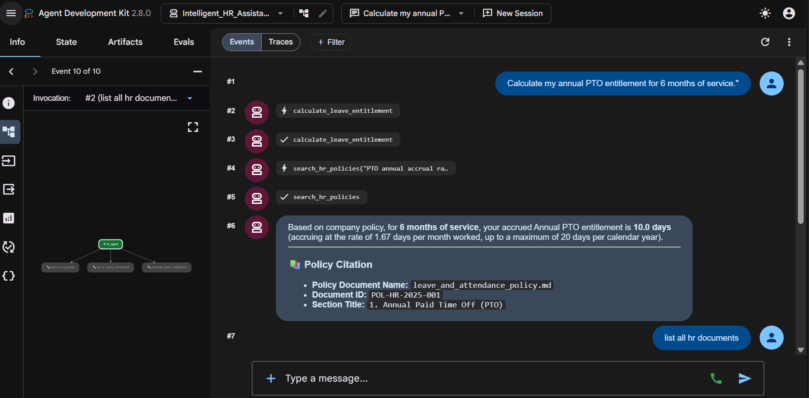

# Intelligent HR Assistant Agent

An enterprise-grade HR assistant agent built using the official **Google Agent Development Kit (Google ADK)**, **ChromaDB**, and **Retrieval-Augmented Generation (RAG)** to securely process local company policy documents and deliver precise, policy-compliant responses to employee inquiries.

---

## Google ADK Web Interface Preview



*The Google ADK Web UI running at `http://127.0.0.1:8000`, demonstrating the active agent, tool invocation, and policy-compliant cited responses.*

---

## Canonical Google ADK Architecture

This project is built directly on the official Google ADK specifications, featuring an exported `root_agent` discovered natively by `adk web`, `adk run`, and `adk api_server`:

```
Intelligent_HR_Assistant_Agent/
├── .git/                               # Independent Git repository
├── .gitignore                          # Repository gitignore (tracks .env)
├── .env & .env.example                 # Environment variables
├── README.md                           # Project documentation
├── requirements.txt                    # Project dependencies (google-adk, chromadb, etc.)
├── agent.py                            # Official ADK entrypoint (exposes root_agent)
├── __init__.py                         # Exposes agent & root_agent
├── chroma_db/                          # Persistent ChromaDB vector storage (26 chunks)
├── documents/                          # Enterprise HR policy markdown documents
│   ├── code_of_conduct_ethics.md
│   ├── compensation_and_bonus_policy.md
│   ├── health_and_wellness_benefits.md
│   ├── leave_and_attendance_policy.md
│   └── remote_and_hybrid_work_policy.md
├── hr_agent/                           # Official ADK agent package
│   ├── __init__.py                     # Package init exposing agent and root_agent
│   ├── agent.py                        # ADK Agent definition with instructions & tools
│   ├── config.py                       # Configuration & dotenv loader
│   ├── ingest.py                       # Document chunker & ChromaDB indexing
│   ├── tools.py                        # ADK registered tools (RAG, Catalog, Leave Calc)
│   └── vector_store.py                 # ChromaDB client & similarity search
├── pictures/                           # Web UI screenshots
│   └── hr-adk-agent.png
└── tests/
    └── test_hr_agent.py                # Automated Pytest suite (8 tests)
```

---

## Running the Agent with Google ADK Web UI (`adk web`)

The Google ADK CLI includes a built-in FastAPI web server and browser-based developer UI (`adk web`) for testing agents, inspecting tool calls, and managing conversational sessions.

### Step 1: Configure Your Environment
Ensure your `.env` file contains your Google Gemini API key:

```env
GEMINI_API_KEY=your_gemini_api_key_here
HR_AGENT_MODEL=gemini-2.5-flash
```

### Step 2: Ensure Policy Documents are Indexed
Run the ingestion pipeline once to populate the local ChromaDB vector database:

```bash
python -m hr_agent.ingest
```
*Expected output: `[SUCCESS] Indexed 26 chunks into ChromaDB at: ./chroma_db`*

### Step 3: Launch `adk web`
From inside the `Intelligent_HR_Assistant_Agent` folder, execute:

```bash
# Standard launch:
adk web .

# Or specify a custom port:
adk web --port 8000 .

# Or enable auto-reload during development:
adk web --reload .
```

> **Fallback Command**: If `adk` is not in your shell's PATH, you can always run it directly through Python:
> ```bash
> python -m google.adk.cli web .
> ```

### Step 4: Open and Use the Web UI
1. Once launched, open your web browser to:
   ```
   http://127.0.0.1:8000
   ```
2. **Select the Agent**: The Web UI automatically discovers and displays `Intelligent_HR_Assistant_Agent` / `hr_agent`.
3. **Inspect Tools**: Click on the agent details to see the 3 registered Google ADK tools:
   - `search_hr_policies`: ChromaDB semantic RAG retrieval.
   - `list_all_policy_documents`: Policy catalog lookup.
   - `calculate_leave_entitlement`: Structured PTO, sick, parental, and bereavement rule calculations.
4. **Chat with the Agent**: Send employee inquiries (e.g. *"What is our home office equipment stipend?"*). You can observe the agent autonomously invoke `search_hr_policies`, retrieve the excerpt from `remote_and_hybrid_work_policy.md`, and formulate a cited response.
5. **Inspect Traces & Telemetry**: Click on individual turns in the chat to view the exact function call arguments, retrieved document chunks, latency, and model thought tokens.


---

## Alternative Google ADK Execution Modes

### 1. Terminal Interactive Mode (`adk run`)
Run the agent in a conversational terminal loop powered directly by Google ADK:
```bash
adk run .
# Or:
python -m google.adk.cli run .
```

### 2. REST API Server (`adk api_server`)
Serve the agent as a headless FastAPI REST API backend (for microservice integration):
```bash
adk api_server --port 8000 .
```

### 3. Automated Pytest Suite
Verify that all unit tests, chunking algorithms, and tool executions pass:
```bash
python -m pytest tests/ -v
```

---

## Sample Employee Inquiries to Try in `adk web`

- *"How many weeks of paternity leave am I entitled to?"*
- *"What is our home office equipment setup stipend for remote workers?"*
- *"What wellness or gym benefits does the company provide annually?"*
- *"How does the company 401(k) retirement matching work?"*
- *"Do I need a doctor's note for taking 2 days of sick leave?"*
- *"Can I work remotely from another country or state temporarily?"*
- *"List all official company policies available in the HR portal."*
- *"Calculate my annual PTO entitlement for 6 months of service."*
